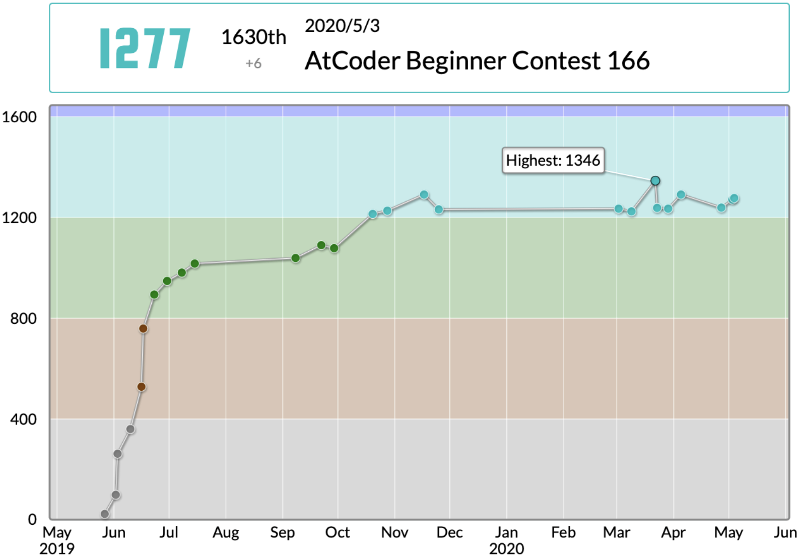

# 🏫 学業
- 東大理三1年(2024年2月時点;再受験)←東大院工学系研究科TMI(修士)←東大薬(学士)
- (修士)機械学習(XGBoost, LightGBM, LSTM)を用いた医療データ解析
- (学士)バイオインフォマティクスによる脳神経細胞のsingle cell RNAseq解析

# 📝 資格等
- 🇺🇸TOEIC 905
- 🇨🇳HSK 4級 (6級が最難)
- 💻AtCoder 水色

# 🏆受賞歴等
- 東大院TMI 専攻長賞
- 東大院TMI 全優修了
- SFC STUDENT AWARD 2017, 2018
- 日本生物学オリンピック金賞

# 💻言語
- Python (学士+修士 計2年半)
- R (学士 1年)
- C++ (AtCoder 8ヶ月のうち時々)

# 💻開発環境
- Python: Google Colab
- R: RStudio
- C++: VSCode

# 🏢インターン
- バイオベンチャー 7ヶ月, 業務: 生物学に関するアドバイザリー業務/リサーチ業務
- VC 4ヶ月, 業務: 技術リサーチ
